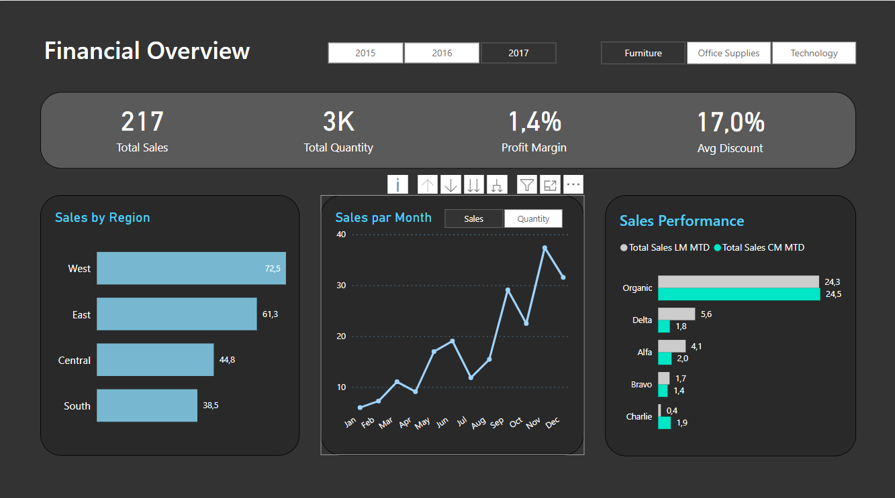
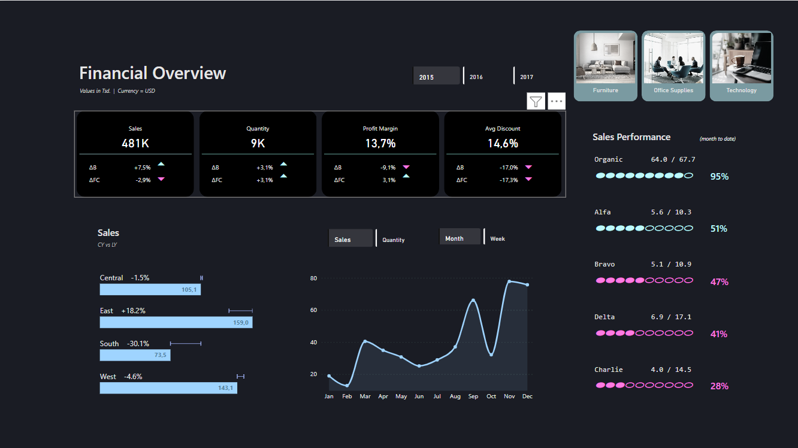

# Projet : DESIGN RELOOKING

## Catégorie
**Visualisation**

## Outils utilisés
**PowerBI**

## Année
**2023/2024**

## Détail de projet
Ce projet met l'accent sur l'importance du design pour améliorer l'impact des analyses et KPIs. En mettant en avant les nouvelles visualisations d'Avril 2024 telles que les cartes, les segments et les KPIs, le rapport offre une expérience visuelle enrichie. Avant le relooking, les visualisations peuvent sembler basiques et peu attrayantes, tandis qu'après, avec un design soigné, elles deviennent plus dynamiques et engageantes.

## Captures d'écran

Avant : 

Après : 

